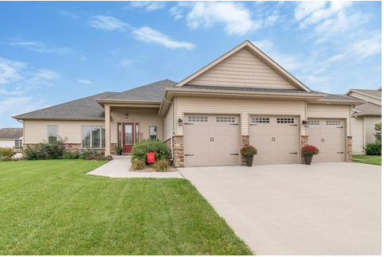
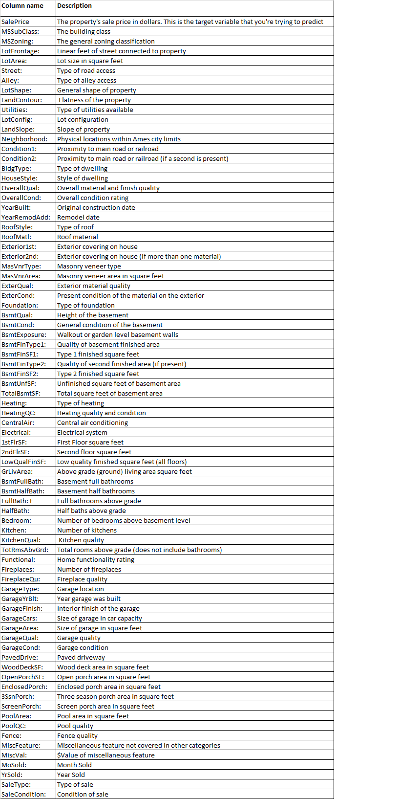
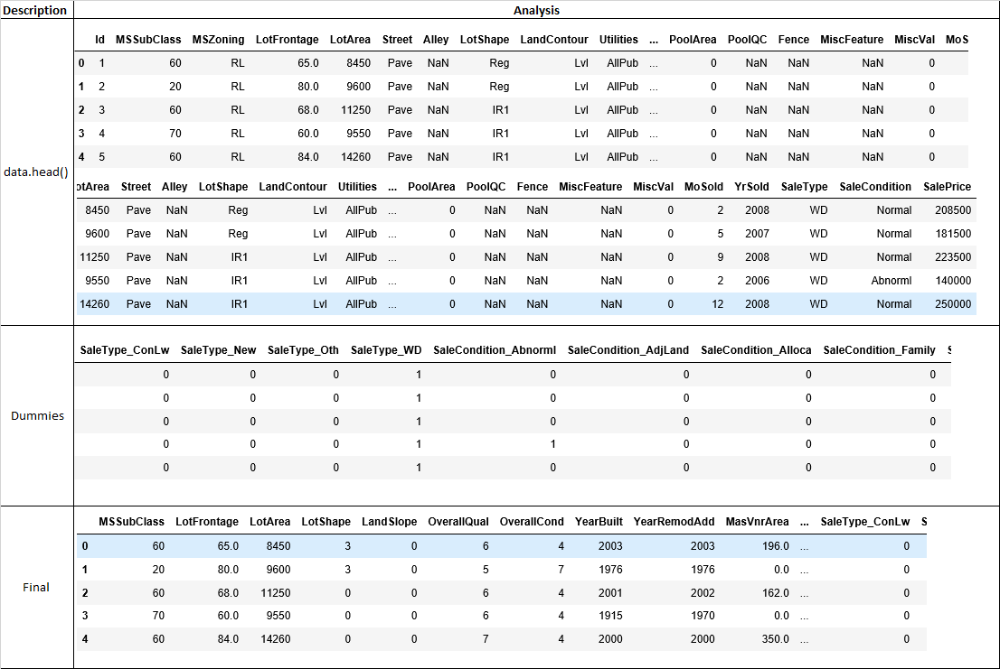

# ML house-price-predictions

## Introduction

The goal of this project is to predict the house sales prices from the given data. The first part consists of various visualization and normalization. By visualizing the distribution of features, we can gain some insight how to handle the data and determine the direction of the project. Also the distribution of target variable is transformed to normal by taking logarithm function so that they can fit many linear models better and lead better performance.

The second part is feature engineering. It comprises filling missing values, encoding and transformation of skewed features. Got some insights from web about this data so that will help you when to fill the missing values with zero instead of None or mode (the most frequent value). The next thing to do is encoding. Dataset must be transformed to appropriate format that a machine learning model can handle. By using LabelEncoder and get_dummies, we can convert them into a numerical representation that we can apply our machine learning algorithms to. Once we finish the encoding process, some highly skewed features need to be transformed to normal as the target variable was transformed.

Lastly, we will fit train data in different algorithm models and evaluate them based R-squared and adjusted R-sqaured values. Since is is regressor problem as dependent variable is continuous we will us relevant algorithms and evaluation methods.

## Data fields
Here's a brief version of what you'll find in the data description file.

## Project analysis

## Highlights 

- We found outliers in data set and removed those. There were many missing values in dataset and those were replaced by mean, mode or zeros depending on type of variables  
- Sales price data was skewed and we applied log1p function for reducing skeweness  
- We applied different algorithms and evaluated those based on R-squared values  

[Jupyter Notebook](./HousePricePredictions.ipynb)

